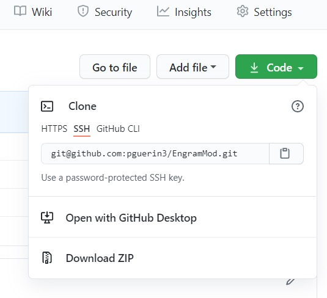

# The Modified Engram Keyboard Layout - EngramMod

This repository is for the modified Engram keyboard layout.

The original Engram keyboard layout is at the following link:
https://github.com/binarybottle/engram

For the layout of the modified Engram layout, the letters are the same as for the original Engram layout.


However the layout of the punctuation is mostly the same as Qwerty.


Following are installation instructions for :
 + Windows
 + Xorg X11


# Installation instructions for Windows

## Download

Click on the green 'code' button near the top of the page.

Then click 'Download ZIP'.




## Installation

Execute the setup executable inside the install4Windows directory:
 - setup.exe


## Switching between layouts

* Now setup the ability to choose and switch between QWERTY and your new layout. 
* Go to Control Panel > All Control Panel Items > Language > Advanced settings. 
* In the Switching Input Methods category, enable Use the desktop language bar when available.
* Choose Options


* Choose the Docked In The Taskbar option.


* Logout then login. There is no need to reboot.

* On startup you'll see the Input Method icon in the task bar. This can be set to instead show the Input Method icon in the top-right corner of the desktop where you'll be able to easily switch to either layout with the mouse. 

* Now you can switch at any time to the layout that you want.


## Uninstallation

* Choose the apps and features from the application launcher.


* Now you're free to uninstall any single layout at a time.


## Microsoft Keyboard Layout Creator (MSKLC) Version 1.4

Note - the executables were created using the Microsoft Keyboard Layout Creator (MSKLC) Version 1.4.

[MSKLC - download](https://www.microsoft.com/en-us/download/details.aspx?id=102134)


# Installation instructions for Xorg X11

## Installation

Append this text to the xkb/symbols/us file of your X11 installation.

```
// EngramMod 
partial alphanumeric_keys
xkb_symbols "EngramMod" {

	include "us"
	name[Group1]= "English (EngramMod)";

	key <TLDE> { [        grave,   asciitilde ] };
	key <AE01> { [            1,       exclam ] };
	key <AE02> { [            2,           at ] };
	key <AE03> { [            3,   numbersign ] };
	key <AE04> { [            4,       dollar ] };
	key <AE05> { [            5,      percent ] };
	key <AE06> { [            6,  asciicircum ] };
	key <AE07> { [            7,    ampersand ] };
	key <AE08> { [            8,     asterisk ] };
	key <AE09> { [            9,    		less ] };
	key <AE10> { [            0,   		greater ] };
	key <AE11> { [        minus,   underscore ] };
	key <AE12> { [        equal,         plus ] };

	key <AD01> { [            y,            Y ] };
	key <AD02> { [            p,            P ] };
	key <AD03> { [            o,            O ] };
	key <AD04> { [            x,            X ] };
	key <AD05> { [  bracketleft,    braceleft ] };
	key <AD06> { [ bracketright,   braceright ] };
	key <AD07> { [            f,            F ] };
	key <AD08> { [            c,            C ] };
	key <AD09> { [            m,            M ] };
	key <AD10> { [    		  w,        	W ] };
	key <AD11> { [  		q,    		Q ] };
	key <AD12> { [    semicolon,        colon ] };
	key <BKSL> { [    backslash,          bar ] };

	key <AC01> { [            h,            H ] };
	key <AC02> { [            i,            I ] };
	key <AC03> { [            e,            E ] };
	key <AC04> { [            a,            A ] };
	key <AC05> { [        comma,        parenleft ] };
	key <AC06> { [       period,      parenright] };
	key <AC07> { [            t,            T ] };
	key <AC08> { [            s,            S ] };
	key <AC09> { [            n,            N ] };
	key <AC10> { [            r,            R ] };
	key <AC11> { [   			z,     		Z ] };

	key <AB01> { [            g,            G ] };
	key <AB02> { [            k,            K ] };
	key <AB03> { [            j,            J ] };
	key <AB04> { [            u,            U ] };
	key <AB05> { [        slash,     question ] };
    key <AB06> { [   apostrophe,     quotedbl ] };
    key <AB07> { [            d,            D ] };
    key <AB08> { [            v,            V ] };
    key <AB09> { [       	  b,      		B ] };
	key <AB10> { [        	  l,     		L ] };

	key <SPCE> { [        space,        space ] };

	// key <CAPS> { [    BackSpace,       Escape,       BackSpace,        BackSpace ] };

	// do NOT hardcode this switch; use the setxkbmap option instead!
	//include "level3(ralt_switch)"
};
```

## Switching between layouts
To interactively switch to a new layout with the right-alt key:
```
$ setxkbmap -layout us,us -variant ,EngramMod -option ""
$ setxkbmap -layout us,us -variant ,EngramMod -option "grp:toggle"
```

Add this to the .bash_profile to keep the configuration for next time:
```
$ setxkbmap -layout us,us -variant ,EngramMod -option "grp:toggle"
```


