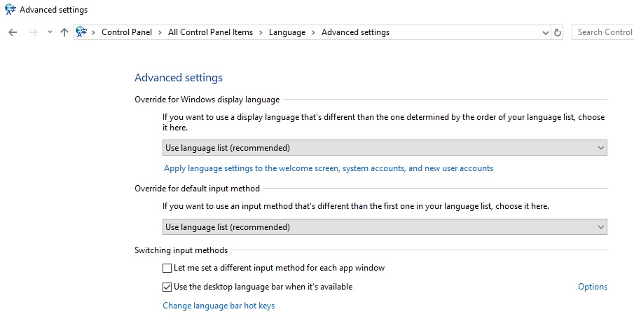
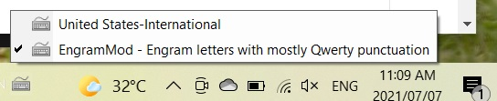
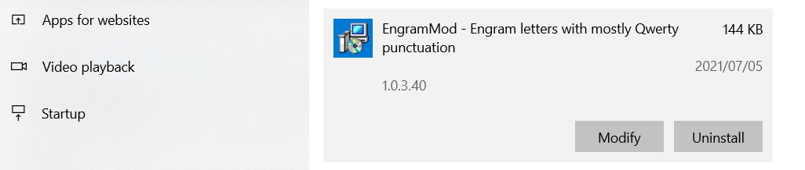

# Installation instructions for Windows

## Download

Click on the green 'code' button near the top of the page.

Then click 'Download ZIP'.

<<<<<<< HEAD

=======

>>>>>>> c65eb0139ee1e1c6025281291490053650c63177

## Installation

Execute the setup executable inside the install4Windows directory:
 - setup.exe

## Switching between layouts

* Now setup the ability to choose and switch between QWERTY and your new layout. 
* Go to Control Panel > All Control Panel Items > Language > Advanced settings. 
* In the Switching Input Methods category, enable Use the desktop language bar when available.
* Choose Options

<<<<<<< HEAD

* Choose the Docked In The Taskbar option.

=======

* Choose the Docked In The Taskbar option.

>>>>>>> c65eb0139ee1e1c6025281291490053650c63177

* Logout then login. There is no need to reboot.

* On startup you'll see the Input Method icon in the task bar. This can be set to instead show the Input Method icon in the top-right corner of the desktop where you'll be able to easily switch to either layout with the mouse. 

* Now you can switch at any time to the layout that you want.

<<<<<<< HEAD

=======

>>>>>>> c65eb0139ee1e1c6025281291490053650c63177

## Uninstallation

* Choose the apps and features from the application launcher.

<<<<<<< HEAD

* Now you're free to uninstall any single layout at a time.

=======

* Now you're free to uninstall any single layout at a time.

>>>>>>> c65eb0139ee1e1c6025281291490053650c63177

## Microsoft Keyboard Layout Creator (MSKLC) Version 1.4

Note - the executables were created using the Microsoft Keyboard Layout Creator (MSKLC) Version 1.4.

[MSKLC - download](https://www.microsoft.com/en-us/download/details.aspx?id=102134)

